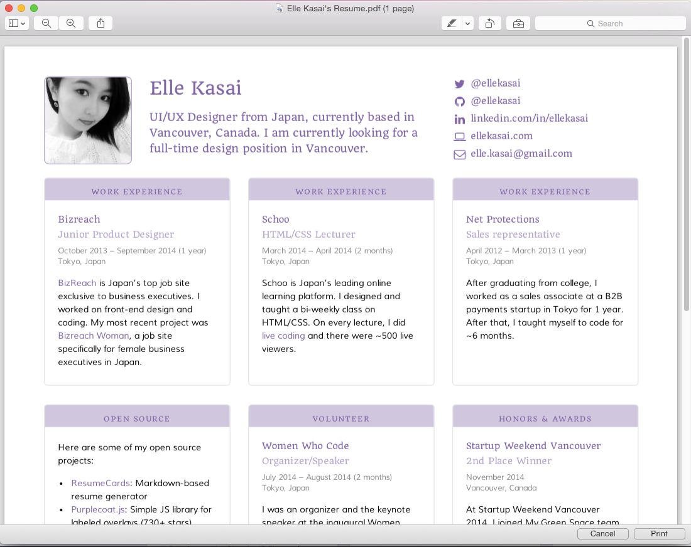

# :briefcase: resumecards :briefcase:

Resumecardsは､簡単にキレイなレジュメを作成できるジェネレーターツールです｡

## :briefcase: Live Demo :briefcase:

### [View Demo and Documentation](http://ellekasai.github.io/resumecards)


You can save it as PDF too:



## :briefcase: Usage :briefcase:

**Note:** ResumeCards uses Jekyll. Please read [Jekyll's documentation](http://jekyllrb.com/) if you get stuck.

[Fork this repo](http://github.com/ellekasai/resumecard/fork), clone it, and then run:

```
bundle install
```

...which installs `github-pages` gem. After that, run the server:

```
jekyll serve --watch
```
### Warning

* Once the server is started, you must go to [http://localhost:4000/resumecards/](http://localhost:4000/resumecards/), since `baseurl` is set as `"/resumecards"` initially. To use  http://localhost:4000/, change `baseurl` in `_config.yml` to `""` .

## :briefcase: Customization :briefcase:

### Required

You **should** change these files before deploying:

* `_config.yml`: You must change `baseurl`and `url`.
  * Make sure to restart the server after you update `_config.yml`.
* `_data/resume.yml`: You must change `photo`, `name` and `url`. Also, you must set `demo` to `false` to hide everything but your resume.
* `CNAME`: Change this to host Shiori on a custom domain.
* `README.md`: Write your own README!
* `_includes/script.html`: Extra stuff before the `</body>` tag. Change or remove the default Google Analytics code.
* `_includes/nav.html`: Modify or remove your contact links.
* `_posts/card-1~card-9`: Add your own posts.

### Customize the Theme

To customize the color theme, edit the `color` section of `_data/resume.yml`.

#### Red


#### Pink


#### Brown


#### Blue


#### Purple


#### Teal


#### Green


### Add Your Own CSS

You can customize CSS by editing these files:

* `_sass/custom-bootstrap-variables.scss`: Change Bootstrap variables ([documentation](http://getbootstrap.com/customize)).
* `stylesheets/resumecards.scss`: Add your own custom CSS.

## :briefcase: Author & License :briefcase:

Elle Kasai

- [Website](http://ellekasai.com/about)
- [Twitter](http://twitter.com/ellekasai)

[MIT License](http://ellekasai.mit-license.org).

## :briefcase: Special Thanks :briefcase:

* [Shu Uesugi](http://github.com/chibicode) - for the guidance on this project.


